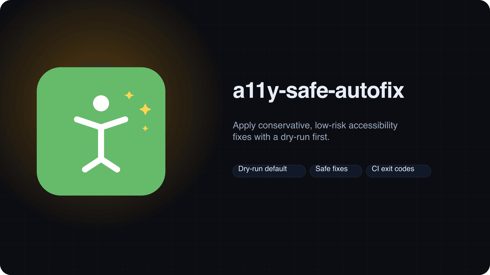
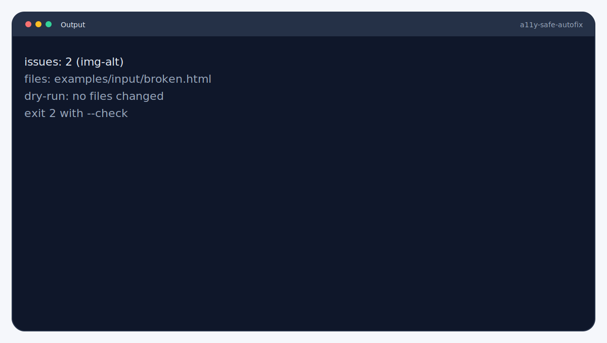
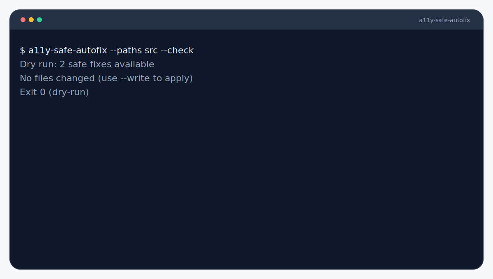

<picture>
  <source srcset="branding/hero.svg" type="image/svg+xml">
  
</picture>

# A11y Safe Autofix
Apply conservative, low-risk accessibility fixes with a dry-run first. Dry-run by default so CI can fail safely without edits.

**Type:** CLI (Node.js)

   

> [!IMPORTANT]
> Dry-run mode is default. Use `--write` only after reviewing the report.

## Highlights
- Dry-run first, conservative fixes only.
- Deterministic exit codes for CI gating.
- Human-reviewable reports before write mode.


## Output


Example artifacts live in `examples/`.

Need help? Start with `docs/troubleshooting.md`.


## Quickstart
```bash
npx a11y-safe-autofix --paths .
```


## CI in 60s
```yaml
- name: Dry-run accessibility fixes
  run: npx a11y-safe-autofix --paths src --check --json
```

## Demo


```bash
a11y-safe-autofix --paths src --check
```


## Compatibility
- Node.js: 20 (CI on ubuntu-latest).
- OS: Linux in CI; macOS/Windows unverified.
- External deps: none.

## Guarantees & Non-Goals
**Guarantees**
- Dry-run is the default mode.
- Only fixes missing `alt` on `` when `--write` is set.

**Non-Goals**
- Not a full accessibility audit.
- Does not infer descriptive alt text.

Accessibility requires more than automated fixes. Treat this as baseline hygiene, not compliance.

## Docs
- [Requirements](docs/requirements.md)
- [Usage](docs/usage.md)
- [Supported Fixes](docs/supported-fixes.md)
- [Safety Model](docs/safety-model.md)
- [Output](docs/output.md)
- [Troubleshooting](docs/troubleshooting.md)
- [Guarantees & Non-Goals](docs/guarantees.md)
- [Constraints](docs/constraints.md)

More: [docs/README.md](docs/README.md)

## Examples
See `examples/README.md` for inputs and expected outputs.

## Used By
Open a PR to add your org.


## Contributing
See `CONTRIBUTING.md`.

## License

MIT
