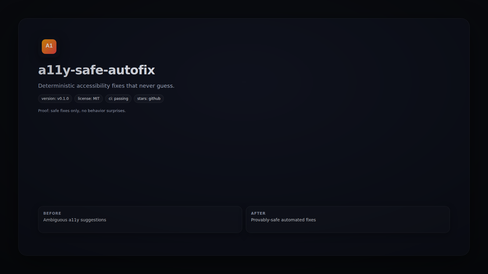

# a11y-safe-autofix



   

Deterministic accessibility fixes that never guess.

## Quickstart
```bash
npx a11y-safe-autofix --check src
```

## Demo
```bash
a11y-safe-autofix --apply src
```

## Why This Exists
CI-friendly fixes with zero heuristics and no semantic risk.

## FAQ
- **Does it modify code?** Only in `--apply` mode.
- **Is it ESLint-compatible?** Yes, it is a plugin + CLI.

## Contributing
See `CONTRIBUTING.md` for rule and test guidance.

## License
MIT
